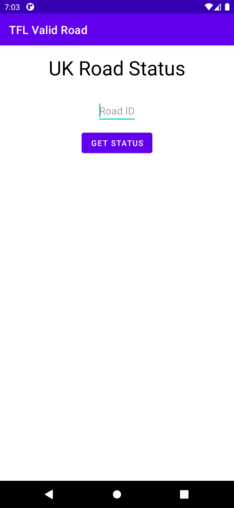
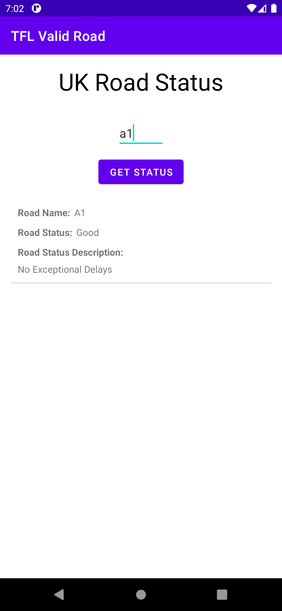
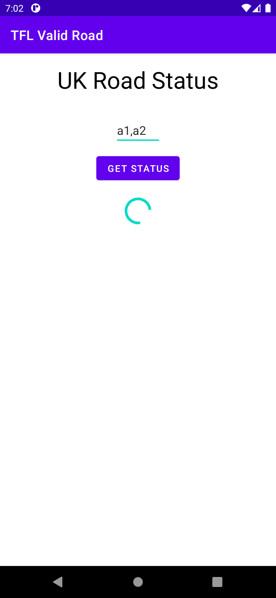
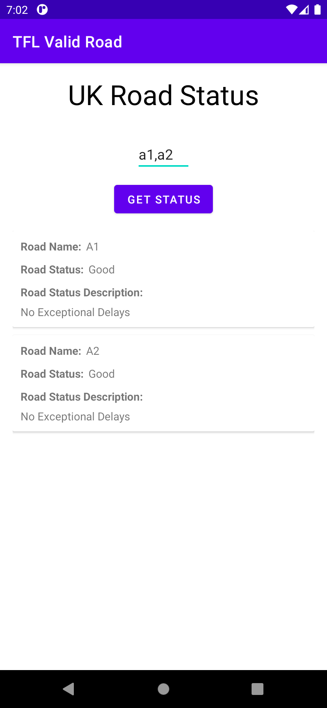
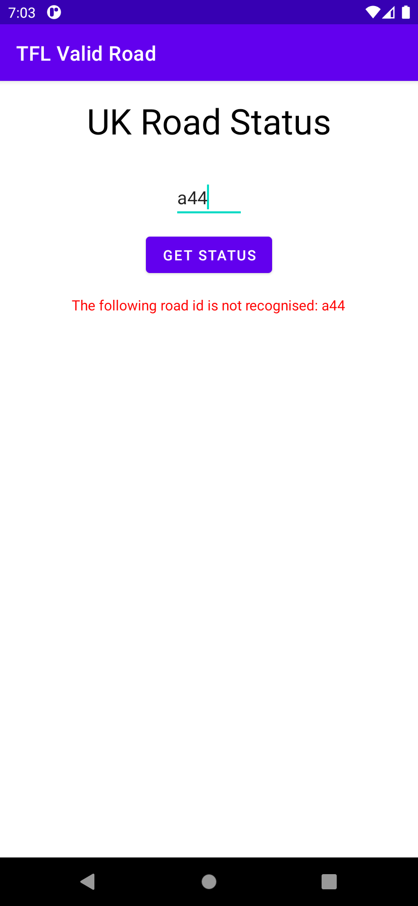

# Android Application using TfL Road Status API

This is an Android Application built using  MVVM with Hilt and ViewModel .

## Installation
Clone this repository and import it into **Android Studio**
```
git clone git@github.com:MrThiago/TfL-Road-Status-API.git
```

## Configuration
Add TfL API key

Please add your TfL app_key to the gradle.properties file
```
tfl_app_key=<your app key>
```

To get a new app_key register here https://api-portal.tfl.gov.uk/signup
## Run
--------------
Once you have added your app_key:
* Build the project and Run
* In the EditText enter a Road ID (for example 'a1') and then press the button "GET STATUS"
* The App will fetch the Road Status for that Road ID and display the information in a List
* If an invalid id is entered, the App will display an informative error message

If you want to check all the available Roads ids, Press the button "GET STATUS" without typing anything in the Edittext

## Screenshots
|  |  |  |  |  |